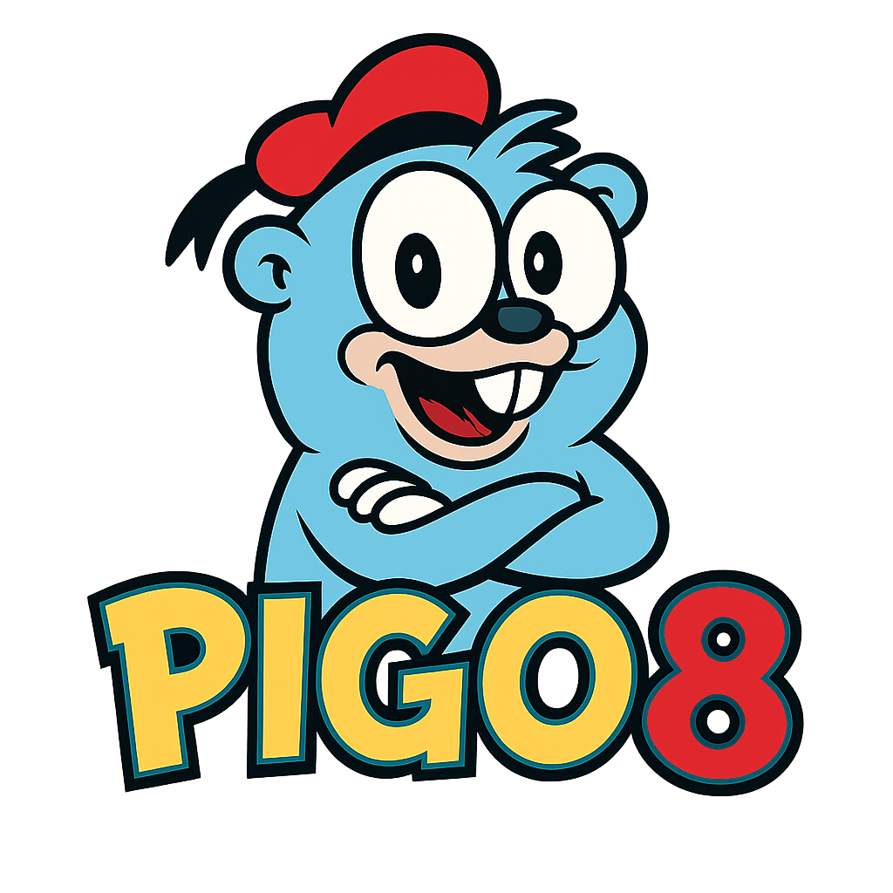

# pigo8

[![License][License-Image]][License-Url]
[![CI][CI-Image]][CI-URL]
[](https://goreportcard.com/report/drpaneas/pigo8)
[![Publish docs][Doc-Image]][Doc-URL]
[![Dependabot Updates][Dependabot-Image]][Dependabot-URL]



PIGO8 is a Go library (package) that reimagines the creative spirit of the PICO-8 fantasy console, allowing developers to build charming, retro-style games entirely in Go.
Built on top of [Ebitengine], PIGO8 gives you a pixel-perfect environment with a familiar and fun API inspired by PICO-8, without needing to learn Lua and start your arrays counting from 1.

While PIGO8 is inspired by PICO-8, it does not contain or distribute any part of the original PICO-8 engine or its proprietary assets.
It is a clean-room reimplementation for educational and creative purposes.

## Features

* Go-first API: Design and develop retro games in idiomatic Go code.
* PICO-8 Style: Recreates the look and feel of the PICO-8 API and game loop.
* Sprite & Map Support: Import .p8 files and reuse your graphics and map data.
* Backed by Ebiten: Harness cross-platform power with minimal setup.
* Nostalgic Aesthetic: Build games that feel right at home on a fantasy console.

## Quick Start

### Installation

```sh
go get github.com/drpaneas/pigo8
```

### Hello World

```go
package main

import p8 "github.com/drpaneas/pigo8"

type myGame struct{}

func (m *myGame) Init() {}

func (m *myGame) Update() {}

func (m *myGame) Draw() {
 p8.Cls(1)
 p8.Print("hello, world!", 40, 60)
}

func main() {
 p8.InsertGame(&myGame{})
 p8.Play()
}
```

## Using .p8 Files

If you have existing assets made in PICO-8, you can load them by using [parsepico].
This will read your `*.p8` cartridge and extract `spritesheet.json` and `map.json`.
By placing those two JSON files into the same directory with your PIGO8 game, they will automatically get picked up by the library.

**Note**: You must own a legitimate copy of PICO-8 to access its files.
PIGO8 does not redistribute any proprietary data or code from Lexaloffle.

## Documentation

Find documentation and usage examples on the PIGO8 Wiki soon.

## Contributing

Contributions are welcome! Whether it's fixing bugs, adding features, or improving docs—pull requests and issues are encouraged.
If you are interested in contributing to PIGO8, read about our [Contributing guide](./CONTRIBUTING.md)

## License

### PICO-8

PIGO8 is released under the [MIT License](LICENSE).
It is not affiliated with or endorsed by [Lexaloffle] Games.

[PICO-8] is a trademark of [Lexaloffle] Games.
This project is a community-made, open-source interpretation and requires that users own [PICO-8] to use any `.p8` assets.

### Font Attribution

The font used in this project, [PICO-8 wide reversed], was created by [RhythmLynx] using [FontStruct], and is licensed under the [Creative Commons CC0 1.0 Public Domain Dedication](https://creativecommons.org/publicdomain/zero/1.0/).

More info and source: PICO-8 Font on GitHub and FontStruct page.

[Ebitengine]: https://ebitengine.org/
[parsepico]: https://github.com/drpaneas/parsepico
[Lexaloffle]: https://www.lexaloffle.com/
[PICO-8]: https://www.lexaloffle.com/pico-8.php
[PICO-8 wide reversed]: https://fontstruct.com/fontstructions/show/1340755/pico-8-6-1
[RhythmLynx]: https://fontstruct.com/fontstructors/1302418/rhythmlynx
[FontStruct]: https://fontstruct.com/
[License-Url]: https://mit-license.org/
[License-Image]: https://img.shields.io/badge/License-MIT-blue.svg
[CI-URL]: https://github.com/drpaneas/pigo8/actions/workflows/ci.yml
[CI-Image]: https://github.com/drpaneas/pigo8/actions/workflows/ci.yml/badge.svg
[Dependabot-URL]: https://github.com/drpaneas/pigo8/actions/workflows/dependabot/dependabot-updates
[Dependabot-Image]: https://github.com/drpaneas/pigo8/actions/workflows/dependabot/dependabot-updates/badge.svg
[Doc-URL]: https://github.com/drpaneas/pigo8/actions/workflows/mdbook.yml
[Doc-Image]: https://github.com/drpaneas/pigo8/actions/workflows/mdbook.yml/badge.svg
