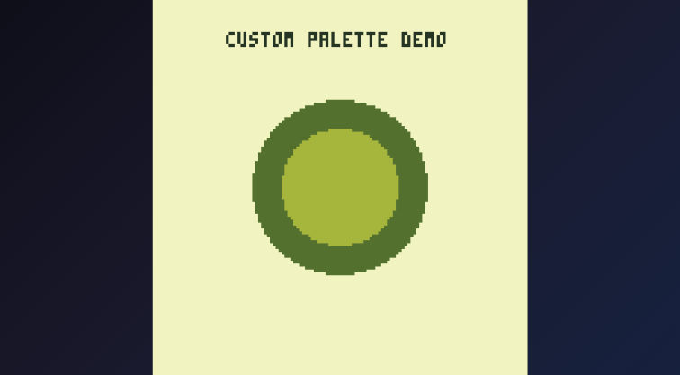

# Palette Effects

## Pal - Color Swapping

`Pal` remaps one color to another for all subsequent drawing operations.

### Swap a Single Color

```go
p8.Pal(8, 12)  // Red (8) draws as blue (12)
```

Now when you draw something in color 8 (red), it appears as color 12 (blue).

### Reset All Mappings

```go
p8.Pal()  // Reset to default (each color draws as itself)
```

### Example: Character Variants

Use palette swapping to create color variants of the same sprite:

```go
func (g *game) Draw() {
    p8.Cls(0)
    
    // Original player (red shirt)
    p8.Spr(1, 20, 60)
    
    // Player 2 (swap red to blue)
    p8.Pal(8, 12)
    p8.Spr(1, 60, 60)
    p8.Pal()  // Reset
    
    // Player 3 (swap red to green)
    p8.Pal(8, 11)
    p8.Spr(1, 100, 60)
    p8.Pal()  // Reset
}
```



## Palt - Transparency Control

`Palt` controls which colors are treated as transparent when drawing sprites.

### Make a Color Transparent

```go
p8.Palt(8, true)  // Red (8) becomes transparent
```

### Make a Color Opaque

```go
p8.Palt(0, false)  // Black (0) is now drawn (not transparent)
```

### Reset Transparency

```go
p8.Palt()  // Reset: only black (0) is transparent
```

### Example: Glowing Effect

Make the background show through certain colors:

```go
func (g *game) Draw() {
    p8.Cls(1)  // Dark blue background
    
    // Draw sprite normally
    p8.Spr(5, 40, 60)
    
    // Draw same sprite with yellow transparent (shows background)
    p8.Palt(10, true)  // Yellow transparent
    p8.Spr(5, 80, 60)
    p8.Palt()  // Reset
}
```

## Combining Effects

Create powerful effects by combining `Pal` and `Palt`:

```go
func (g *game) Draw() {
    p8.Cls(0)
    
    // Silhouette effect
    for i := 1; i <= 15; i++ {
        p8.Pal(i, 1)  // All colors become dark blue
    }
    p8.Spr(1, 50, 60)
    p8.Pal()
    
    // Normal sprite next to it
    p8.Spr(1, 70, 60)
}
```

## Flash Effect on Damage

```go
func (g *game) Draw() {
    p8.Cls(0)
    
    if g.playerDamageFrames > 0 {
        // Flash white when damaged
        for i := 0; i <= 15; i++ {
            p8.Pal(i, 7)
        }
        g.playerDamageFrames--
    }
    
    p8.Spr(g.playerSprite, g.playerX, g.playerY)
    p8.Pal()  // Always reset
}
```

