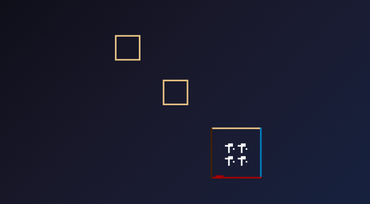

# Arbitrary Sprite Regions

## Sspr - Draw Spritesheet Region

`Sspr` draws any rectangular region from the spritesheet, with optional scaling and flipping.

```go
p8.Sspr(sx, sy, sw, sh, dx, dy)
p8.Sspr(sx, sy, sw, sh, dx, dy, dw, dh)
p8.Sspr(sx, sy, sw, sh, dx, dy, dw, dh, flipX, flipY)
```

### Parameters

| Parameter | Type | Default | Description |
|-----------|------|---------|-------------|
| sx | int | required | Source X on spritesheet |
| sy | int | required | Source Y on spritesheet |
| sw | int | required | Source width (pixels) |
| sh | int | required | Source height (pixels) |
| dx | Number | required | Destination X on screen |
| dy | Number | required | Destination Y on screen |
| dw | float64 | sw | Destination width (pixels) |
| dh | float64 | sh | Destination height (pixels) |
| flipX | bool | false | Flip horizontally |
| flipY | bool | false | Flip vertically |

### Basic Usage

```go
// Draw 16×16 region from (8, 8) to screen at (50, 50)
p8.Sspr(8, 8, 16, 16, 50, 50)
```

### Scaling

```go
// Draw 8×8 source scaled to 32×32 on screen
p8.Sspr(0, 0, 8, 8, 50, 50, 32, 32)

// Draw 16×16 scaled down to 8×8
p8.Sspr(0, 0, 16, 16, 50, 50, 8, 8)
```

### Use Cases

- **Irregular sprite sizes**: Characters that aren't 8×8
- **Scaling**: Boss sprites, zoom effects
- **Partial sprites**: Only show part of a larger image

### Example: Stretched Logo

```go
func (g *game) Draw() {
    p8.Cls(0)
    
    // Draw logo from spritesheet, scaled 2x
    p8.Sspr(0, 0, 32, 16, 32, 50, 64, 32)
}
```



## Sget / Sset - Spritesheet Pixels

Read and write individual pixels on the spritesheet.

### Sget

```go
colorIndex := p8.Sget(x, y)  // Get pixel color (0-15)
```

### Sset

```go
p8.Sset(x, y, colorIndex)  // Set pixel color
```

### Example: Procedural Sprite

```go
func (g *game) Init() {
    // Draw a random pattern on sprite 255 (position 127×127 on sheet)
    for y := 0; y < 8; y++ {
        for x := 0; x < 8; x++ {
            color := p8.Rnd(16)  // Random color
            p8.Sset(120+x, 120+y, color)
        }
    }
}
```

## See Also

- [Sprites](../reference/api/03-sprites.md)

