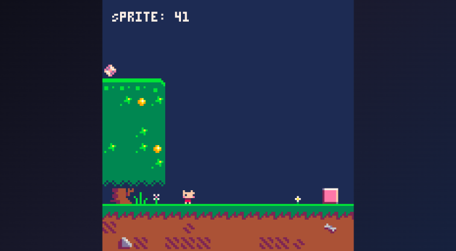

# Drawing Maps

## Map Function

```go
p8.Map(mx, my, sx, sy, w, h, layers)
```

Draws a rectangular region of the map to the screen.

### Parameters

| Parameter | Type | Default | Description |
|-----------|------|---------|-------------|
| mx | int | 0 | Map X position (tiles) |
| my | int | 0 | Map Y position (tiles) |
| sx | int | 0 | Screen X position (pixels) |
| sy | int | 0 | Screen Y position (pixels) |
| w | int | 128 | Width to draw (tiles) |
| h | int | 128 | Height to draw (tiles) |
| layers | int | 0 | Flag bitfield for filtering (0 = all) |

### Basic Usage

```go
// Draw the entire visible area
p8.Map()

// Draw from map position (5, 10)
p8.Map(5, 10)

// Draw at screen position (10, 20)
p8.Map(0, 0, 10, 20)

// Draw a 16×16 tile area
p8.Map(0, 0, 0, 0, 16, 16)
```



### Scrolling

For a scrolling game, offset the map position:

```go
func (g *game) Draw() {
    p8.Cls(0)
    
    // Calculate camera offset in tiles
    camX := int(g.playerX/8) - 8  // Center on player
    camY := int(g.playerY/8) - 8
    
    // Keep camera in bounds
    if camX < 0 { camX = 0 }
    if camY < 0 { camY = 0 }
    
    p8.Map(camX, camY, 0, 0, 16, 16)
}
```

### Layer Filtering

Use the `layers` parameter to draw only sprites with specific flags:

```go
func (g *game) Draw() {
    p8.Cls(0)
    
    // Draw background (sprites with flag 0 set = bit 1)
    p8.Map(0, 0, 0, 0, 16, 16, 1)
    
    // Draw player
    p8.Spr(g.playerSprite, g.playerX, g.playerY)
    
    // Draw foreground (sprites with flag 1 set = bit 2)
    p8.Map(0, 0, 0, 0, 16, 16, 2)
}
```

## Pixel-Perfect Scrolling

For smooth scrolling at sub-tile precision, use the Camera function:

```go
func (g *game) Draw() {
    p8.Cls(0)
    
    // Camera follows player with pixel precision
    p8.Camera(g.playerX - 64, g.playerY - 64)
    
    p8.Map()  // Map scrolls with camera
    p8.Spr(1, g.playerX, g.playerY)  // Player drawn in world coords
    
    // Draw UI without camera offset
    p8.Camera()  // Reset camera
    p8.Print(g.score, 2, 2, 7)
}
```

## See Also

- [Maps](../reference/api/04-maps.md)

