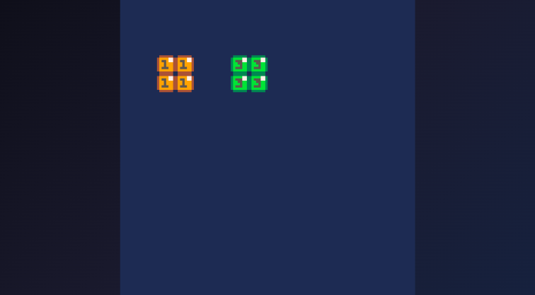

# Map Data Access

## Mget - Read Map Tile

```go
spriteID := p8.Mget(column, row)
```

Returns the sprite ID at the specified tile position.

### Parameters

| Parameter | Type | Description |
|-----------|------|-------------|
| column | int | X position in tiles (0-127) |
| row | int | Y position in tiles (0-127) |

### Returns

- Sprite ID (0-255)
- Returns 0 for out-of-bounds coordinates

### Example

```go
// Check what's at tile (5, 10)
spriteID := p8.Mget(5, 10)
if spriteID == 0 {
    // Empty tile
}
```



## Mset - Write Map Tile

```go
p8.Mset(column, row, spriteID)
```

Sets the sprite ID at the specified tile position.

### Parameters

| Parameter | Type | Description |
|-----------|------|-------------|
| column | int | X position in tiles |
| row | int | Y position in tiles |
| spriteID | int | Sprite ID to place (0-255) |

### Example

```go
// Place sprite 5 at tile (10, 10)
p8.Mset(10, 10, 5)

// Clear a tile (set to empty)
p8.Mset(10, 10, 0)
```

## Dynamic Maps

### Destructible Terrain

```go
func (g *game) Update() {
    if p8.Btnp(p8.X) {  // Fire button
        // Calculate tile in front of player
        tileX := p8.Flr((g.playerX + 8) / 8)
        tileY := p8.Flr(g.playerY / 8)
        
        spriteID := p8.Mget(tileX, tileY)
        _, isBreakable := p8.Fget(spriteID, 2)  // Flag 2 = breakable
        
        if isBreakable {
            p8.Mset(tileX, tileY, 0)  // Remove tile
            g.score += 10
        }
    }
}
```

### Collectibles

```go
func (g *game) Update() {
    // Player tile position
    tileX := p8.Flr(g.playerX / 8)
    tileY := p8.Flr(g.playerY / 8)
    
    spriteID := p8.Mget(tileX, tileY)
    
    // Sprite 10 = coin
    if spriteID == 10 {
        p8.Mset(tileX, tileY, 0)  // Remove coin
        g.coins++
        p8.Music(1)  // Coin sound
    }
}
```

### Doors and Switches

```go
// Pressing a switch opens a door
func (g *game) Update() {
    tileX := p8.Flr(g.playerX / 8)
    tileY := p8.Flr(g.playerY / 8)
    
    // Sprite 20 = switch
    if p8.Mget(tileX, tileY) == 20 && p8.Btnp(p8.X) {
        // Change switch sprite
        p8.Mset(tileX, tileY, 21)  // Activated switch
        
        // Open door at known position
        p8.Mset(g.doorX, g.doorY, 0)
    }
}
```

## See Also

- [Maps](../reference/api/04-maps.md)

