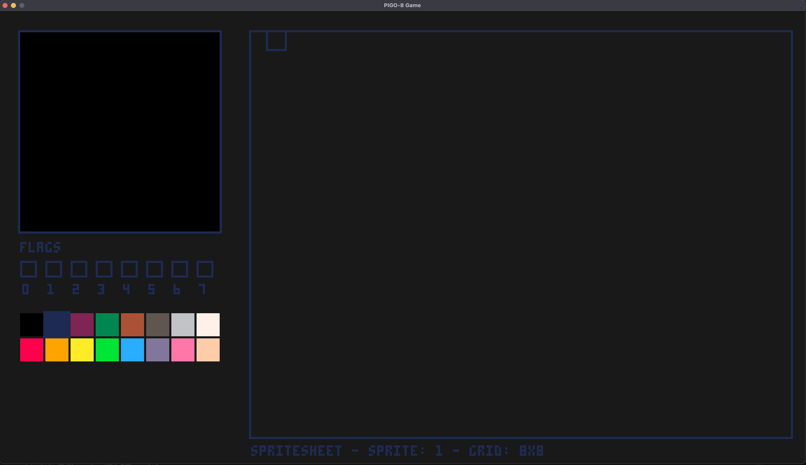
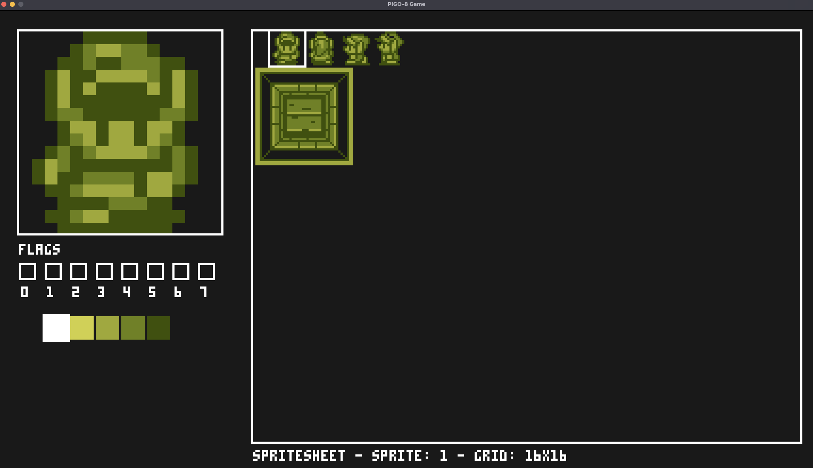
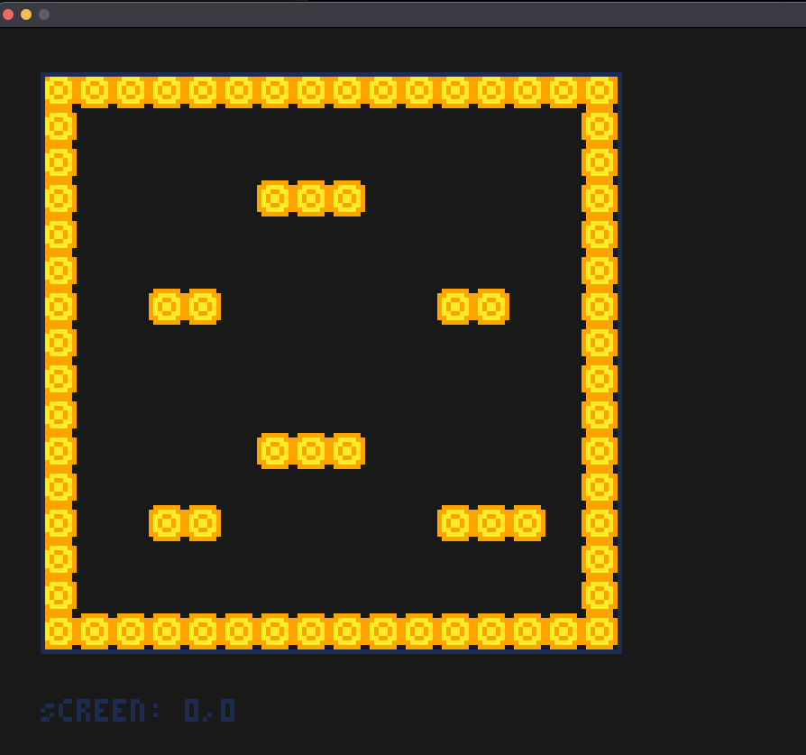

# PIGO8 Editor

The PIGO8 editor is an _extremely minimal_ tool that allows you to create and edit sprites and maps for your PIGO8 games. This documentation covers how to install, run, and use the editor effectively.

## Installation

To install the PIGO8 editor, you need to have Go installed on your system. If you haven't installed Go yet, please refer to the [Installation](01-installation.md) guide.

Once Go is installed, you can install the PIGO8 editor with the following command:

```bash
go install github.com/drpaneas/pigo8/cmd/editor@latest
```

This will download and compile the editor, making it available as a command-line tool in your system.

## Running the Editor

After installation, you can run the editor with the following command:

```bash
editor
```

By default, the editor opens with a 128x128 pixel map viewport (the standard PICO-8 resolution)
in Map Editor mode. You can customize the initial viewport size with the `-w` and `-h` flags:

```bash
editor -w 640 -h 480
```

**Note:** `-w`/`-h` set the initial size of the *map viewport* in pixels, not the overall window
size - the actual editor window is larger, since it also includes the spritesheet panel and
sprite editing tools alongside the map viewport, and the whole window is scaled up 3x for
visibility. Since Map Editor mode supports live panning and zooming (see
[Panning and Zooming](#panning-and-zooming) below), these flags mostly matter for the initial
view - you can freely adjust your framing interactively once the editor is open, so you rarely
need them.

## Editor Interface

The editor has two main modes:

1. **Sprite Editor**: For creating and editing individual sprites
2. **Map Editor**: For arranging sprites into a game map

### Switching Between Modes

You can switch between the sprite editor and map editor by pressing the `X` key on your keyboard. The current mode is displayed at the top of the editor window.

## Sprite Editor



The sprite editor allows you to create and modify individual sprites pixel by pixel. Each sprite is 8x8 pixels in size, matching the PICO-8 standard.

### Drawing

Click and drag on the pixel grid to draw:

- **Left mouse button**: paints the hovered pixel with the currently selected color.
- **Right mouse button**: erases the hovered pixel (sets it to color 0/transparent).

### Choosing a Color

Click any swatch in the color palette (below the pixel grid) to make it the active drawing
color. The currently selected color is highlighted with a border (white, or dark blue if you've
loaded a custom, non-default palette).

### Multi-Sprite Editing

The editor supports multi-sprite editing with different grid sizes. You can toggle between grid sizes using the `mouse wheel`:

* 8x8 (1 sprite)
* 16x16 (4 sprites in a 2x2 grid)
* 32x32 (16 sprites in a 4x4 grid)



This feature allows you to work on larger sprites or sprite collections as a single unit, with proper mapping to the corresponding individual sprites.

### Sprite Flags

Each sprite can have up to 8 flags (Flag0-Flag7) that can be used for game logic (like collision detection, animation states, etc.). You can toggle these flags in the editor interface.

When working with multi-sprite selections, flag changes apply to all selected sprites, with visual indication of mixed flag states when not all selected sprites have the same flag value.

### Navigating Sprites

Click any tile in the spritesheet panel to make it the active sprite, or use the **arrow keys**
to move to an adjacent sprite. Sprite 0 is reserved (it represents "no tile" on the map) and
can't be selected as the active drawing sprite, either by clicking or with the arrow keys.

### Copy & Paste

Copy the current sprite's pixel data and paste it onto another sprite:

- **Cmd+C** (macOS) / **Ctrl+C** (Windows/Linux): copy the current sprite.
- **Cmd+V** / **Ctrl+V**: paste onto the current sprite.

## Map Editor



The map editor allows you to arrange sprites into a game map. The full map is 320x320 tiles,
much larger than what's visible on screen at once - use panning and zooming (below) to navigate
it.

### Placing and Erasing Tiles

- **Left mouse button**: places the currently selected sprite (or sprite block, if using a
  multi-sprite grid size) at the hovered tile.
- **Right mouse button**: erases the tile under the cursor (sets it back to sprite 0).

The bottom info strip shows the tile coordinates and sprite under your cursor, alongside a
preview of the sprite currently selected for placement.

### Panning and Zooming

- **Arrow keys** or **W/A/S/D**: pan the camera around the map.
- **Middle mouse button (drag)**: pan the camera by dragging.
- **Mouse wheel**: zoom in/out (roughly 0.5x-4x).

### Scene Boundaries

Red grid lines are drawn every 16 tiles, marking out PICO-8-style "screens" - useful as a visual
guide when designing camera-based screen transitions (see the
[Camera](60-camera/00-camera.md) guide), even though PIGO8 doesn't enforce any actual boundary
at these lines.

## Undo & Redo

The editor keeps a history of your edits (up to the last 50 states) in both Sprite Editor and
Map Editor modes:

- **Cmd+Z** (macOS) / **Ctrl+Z** (Windows/Linux): undo.
- **Cmd+Shift+Z** / **Ctrl+Shift+Z**: redo.

Making a new edit after undoing clears the redo history, matching standard undo/redo behavior in
most editors.

## Saving and Loading

Your work is saved to two files:

* `spritesheet.json`: Contains all your sprites
* `map.json`: Contains your map data

These files are compatible with the PIGO8 library and can be loaded directly into your games.

The editor writes `spritesheet.json`/`map.json` to disk every time you switch between Sprite
Editor and Map Editor (`X`), and immediately whenever you toggle a sprite flag. **Individual
pixel edits and map tile placements are not written to disk as you make them** - only undo/redo
history is tracked continuously (in memory). Switch modes at least once (even briefly) after a
drawing session to make sure your latest edits are actually persisted to disk before closing the
editor.

## Keyboard & Mouse Shortcuts

| Input | Function | Mode |
|-------|----------|------|
| `X` | Switch between Sprite Editor and Map Editor | Both |
| Left click | Draw pixel / place sprite | Both |
| Right click | Erase pixel / erase tile | Both |
| Arrow keys | Navigate sprites | Sprite Editor |
| Arrow keys / `W` `A` `S` `D` | Pan camera | Map Editor |
| Middle mouse (drag) | Pan camera | Map Editor |
| Mouse wheel | Change grid size (Sprite Editor) / zoom (Map Editor) | Both |
| Click a palette swatch | Select drawing color | Sprite Editor |
| Click a checkbox | Toggle sprite flag | Sprite Editor |
| `Cmd`/`Ctrl` + `Z` | Undo | Both |
| `Cmd`/`Ctrl` + `Shift` + `Z` | Redo | Both |
| `Cmd`/`Ctrl` + `C` | Copy current sprite | Sprite Editor |
| `Cmd`/`Ctrl` + `V` | Paste onto current sprite | Sprite Editor |

## Command Line Options

| Flag | Description | Default |
|------|-------------|---------|
| -w | Initial map viewport width in pixels (rounded down to a multiple of 8) | 128 |
| -h | Initial map viewport height in pixels (rounded down to a multiple of 8) | 128 |

## Example Usage

```bash
# Run editor with default settings
editor

# Run editor with a larger initial map viewport
editor -w 640 -h 480
```

## Next Steps

After creating your sprites and maps with the editor, you can use them in your PIGO8 games. See the [Resource Embedding](90-advanced/01-resource-embedding.md) guide for details on how to include these resources in your game.
