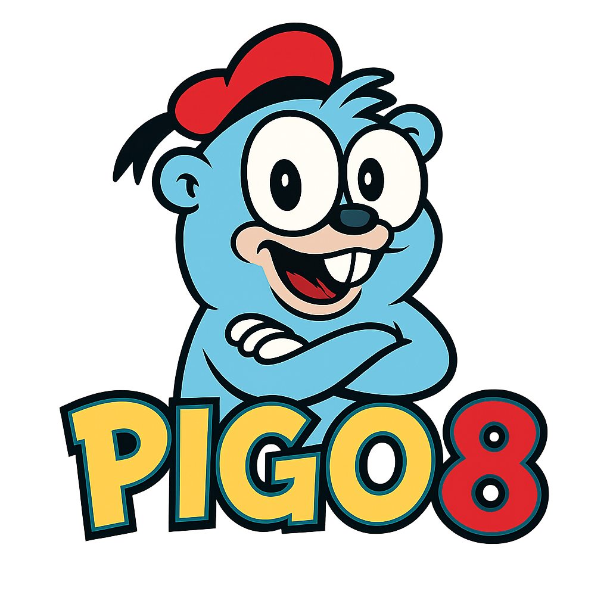

# Introduction

**PIGO8** is a Go library for building retro-style games with intentional constraints that accelerate creativity. Rather than being overwhelmed by infinite possibilities, you work within a focused environment: a compact screen, limited colors, and a simple API that does one thing well.

## Why Build Games with Constraints?

Game development often fails not from lack of tools, but from too many choices. PIGO8 gives you:

- **A fixed canvas**: 128×128 pixels by default (customizable for Game Boy, NES, or other resolutions)
- **A curated palette**: 16 colors that work beautifully together
- **A minimal API**: Draw sprites, handle input, play sounds—nothing more
- **Instant feedback**: See changes immediately with hot reload support

These constraints mirror what made 8-bit game development productive: small scope, clear boundaries, finished games.

## What You Can Build

PIGO8 is ideal for:

- **Arcade games**: Pong, Space Invaders, Breakout clones
- **Platformers**: Side-scrolling adventures with tile-based maps
- **Puzzle games**: Match-3, Tetris-style, or logic puzzles
- **Prototypes**: Test game mechanics before committing to a larger engine
- **Game jams**: Ship something playable in 48 hours

## The PICO-8 Connection

PIGO8 is inspired by [PICO-8](https://www.lexaloffle.com/pico-8.php), a fantasy console with a dedicated following. If you've written PICO-8 games in Lua, you'll find the API familiar. Functions like `Spr()`, `Map()`, `Btn()`, and `Cls()` work similarly.

However, PIGO8 is **not** PICO-8:

- Written in Go, not Lua (arrays start at 0, not 1)
- No artificial code/memory limits
- Can target any resolution, not just 128×128
- Exports to native binaries and WebAssembly
- Open source under MIT license

## What's in This Documentation?

This guide covers:

1. **Getting Started**: Installation and your first game
2. **Graphics**: Drawing pixels, shapes, text, and sprites
3. **Maps**: Tile-based level design
4. **Input**: Keyboard, gamepad, and mouse handling
5. **Audio**: Playing sound effects and music
6. **Game Mechanics**: Camera, collision detection, math utilities
7. **Advanced Topics**: Web export, multiplayer, porting PICO-8 games
8. **Tutorials**: Step-by-step game projects

## Prerequisites

This documentation assumes you:

- Know Go basics (packages, structs, methods, interfaces)
- Have Go 1.21+ installed
- Have a code editor with Go support

You don't need prior game development experience—that's what we're here to teach.
