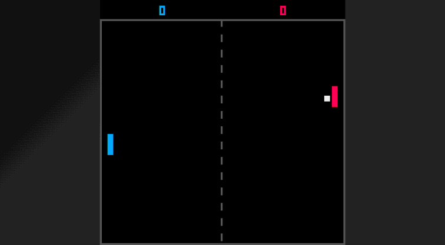

# Tutorial: Building Pong

Let's build a complete Pong game step by step.

## Final Result

Two paddles, a ball, scoring, and AI opponent.



## Step 1: Project Setup

```bash
mkdir pong && cd pong
go mod init pong
go get github.com/drpaneas/pigo8
```

Create `main.go`:

```go
package main

import p8 "github.com/drpaneas/pigo8"

type Game struct{}

func (g *Game) Init()   {}
func (g *Game) Update() {}
func (g *Game) Draw()   { p8.Cls(0) }

func main() {
    p8.InsertGame(&Game{})
    p8.Play()
}
```

## Step 2: Define Game Objects

```go
type Paddle struct {
    x, y, width, height, speed float64
    color int
}

type Ball struct {
    x, y, size   float64
    dx, dy       float64
    color        int
}

type Game struct {
    player   Paddle
    computer Paddle
    ball     Ball
    playerScore   int
    computerScore int
}
```

## Step 3: Initialize Positions

```go
func (g *Game) Init() {
    // Player paddle on the left
    g.player = Paddle{
        x: 4, y: 54,
        width: 4, height: 20,
        speed: 2, color: 12,
    }
    
    // Computer paddle on the right
    g.computer = Paddle{
        x: 120, y: 54,
        width: 4, height: 20,
        speed: 1.5, color: 8,
    }
    
    // Ball in center
    g.ball = Ball{
        x: 62, y: 62,
        size: 4,
        dx: 2, dy: 1,
        color: 7,
    }
}
```

## Step 4: Player Input

```go
func (g *Game) Update() {
    // Player movement
    if p8.Btn(p8.UP) && g.player.y > 0 {
        g.player.y -= g.player.speed
    }
    if p8.Btn(p8.DOWN) && g.player.y+g.player.height < 128 {
        g.player.y += g.player.speed
    }
}
```

## Step 5: Ball Movement and Wall Bouncing

```go
func (g *Game) Update() {
    // ... player input ...
    
    // Move ball
    g.ball.x += g.ball.dx
    g.ball.y += g.ball.dy
    
    // Bounce off top/bottom walls
    if g.ball.y <= 0 || g.ball.y+g.ball.size >= 128 {
        g.ball.dy = -g.ball.dy
    }
}
```

## Step 6: Paddle Collision

```go
func collides(ball Ball, paddle Paddle) bool {
    return ball.x+ball.size >= paddle.x &&
           ball.x <= paddle.x+paddle.width &&
           ball.y+ball.size >= paddle.y &&
           ball.y <= paddle.y+paddle.height
}

func (g *Game) Update() {
    // ... previous code ...
    
    // Paddle collision
    if collides(g.ball, g.player) || collides(g.ball, g.computer) {
        g.ball.dx = -g.ball.dx
    }
}
```

## Step 7: Scoring

```go
func (g *Game) Update() {
    // ... previous code ...
    
    // Score when ball exits
    if g.ball.x < 0 {
        g.computerScore++
        g.resetBall()
    }
    if g.ball.x > 128 {
        g.playerScore++
        g.resetBall()
    }
}

func (g *Game) resetBall() {
    g.ball.x = 62
    g.ball.y = 62
    g.ball.dx = -g.ball.dx  // Serve toward last scorer
}
```

## Step 8: AI Opponent

```go
func (g *Game) Update() {
    // ... previous code ...
    
    // Simple AI: follow the ball
    if g.ball.dx > 0 {  // Ball moving toward AI
        mid := g.computer.y + g.computer.height/2
        if mid < g.ball.y && g.computer.y+g.computer.height < 128 {
            g.computer.y += g.computer.speed
        }
        if mid > g.ball.y && g.computer.y > 0 {
            g.computer.y -= g.computer.speed
        }
    }
}
```

## Step 9: Drawing

```go
func (g *Game) Draw() {
    p8.Cls(0)
    
    // Center line
    for y := 0; y < 128; y += 8 {
        p8.Line(64, float64(y), 64, float64(y+4), 5)
    }
    
    // Paddles
    p8.Rectfill(g.player.x, g.player.y,
        g.player.x+g.player.width, g.player.y+g.player.height,
        g.player.color)
    p8.Rectfill(g.computer.x, g.computer.y,
        g.computer.x+g.computer.width, g.computer.y+g.computer.height,
        g.computer.color)
    
    // Ball
    p8.Rectfill(g.ball.x, g.ball.y,
        g.ball.x+g.ball.size, g.ball.y+g.ball.size,
        g.ball.color)
    
    // Score
    p8.Print(g.playerScore, 32, 4, 12)
    p8.Print(g.computerScore, 92, 4, 8)
}
```

## Complete Code

```go
package main

import p8 "github.com/drpaneas/pigo8"

type Paddle struct {
    x, y, width, height, speed float64
    color                      int
}

type Ball struct {
    x, y, size float64
    dx, dy     float64
    color      int
}

type Game struct {
    player        Paddle
    computer      Paddle
    ball          Ball
    playerScore   int
    computerScore int
}

func (g *Game) Init() {
    g.player = Paddle{x: 4, y: 54, width: 4, height: 20, speed: 2, color: 12}
    g.computer = Paddle{x: 120, y: 54, width: 4, height: 20, speed: 1.5, color: 8}
    g.ball = Ball{x: 62, y: 62, size: 4, dx: 2, dy: 1, color: 7}
}

func (g *Game) Update() {
    // Player input
    if p8.Btn(p8.UP) && g.player.y > 0 {
        g.player.y -= g.player.speed
    }
    if p8.Btn(p8.DOWN) && g.player.y+g.player.height < 128 {
        g.player.y += g.player.speed
    }

    // AI
    if g.ball.dx > 0 {
        mid := g.computer.y + g.computer.height/2
        if mid < g.ball.y && g.computer.y+g.computer.height < 128 {
            g.computer.y += g.computer.speed
        }
        if mid > g.ball.y && g.computer.y > 0 {
            g.computer.y -= g.computer.speed
        }
    }

    // Ball movement
    g.ball.x += g.ball.dx
    g.ball.y += g.ball.dy

    // Wall bounce
    if g.ball.y <= 0 || g.ball.y+g.ball.size >= 128 {
        g.ball.dy = -g.ball.dy
    }

    // Paddle collision
    if collides(g.ball, g.player) || collides(g.ball, g.computer) {
        g.ball.dx = -g.ball.dx
    }

    // Scoring
    if g.ball.x < 0 {
        g.computerScore++
        g.resetBall()
    }
    if g.ball.x > 128 {
        g.playerScore++
        g.resetBall()
    }
}

func (g *Game) Draw() {
    p8.Cls(0)

    // Center line
    for y := 0; y < 128; y += 8 {
        p8.Line(64, float64(y), 64, float64(y+4), 5)
    }

    // Game objects
    p8.Rectfill(g.player.x, g.player.y, g.player.x+g.player.width, g.player.y+g.player.height, g.player.color)
    p8.Rectfill(g.computer.x, g.computer.y, g.computer.x+g.computer.width, g.computer.y+g.computer.height, g.computer.color)
    p8.Rectfill(g.ball.x, g.ball.y, g.ball.x+g.ball.size, g.ball.y+g.ball.size, g.ball.color)

    // Score
    p8.Print(g.playerScore, 32, 4, 12)
    p8.Print(g.computerScore, 92, 4, 8)
}

func (g *Game) resetBall() {
    g.ball.x = 62
    g.ball.y = 62
    g.ball.dx = -g.ball.dx
}

func collides(ball Ball, paddle Paddle) bool {
    return ball.x+ball.size >= paddle.x &&
        ball.x <= paddle.x+paddle.width &&
        ball.y+ball.size >= paddle.y &&
        ball.y <= paddle.y+paddle.height
}

func main() {
    settings := p8.NewSettings()
    settings.TargetFPS = 60
    settings.WindowTitle = "PIGO-8 Pong"
    p8.InsertGame(&Game{})
    p8.PlayGameWith(settings)
}
```

## Next Steps

- Add sound effects for paddle hits and scoring
- Implement difficulty levels
- Add a two-player mode
- Create a title screen
- Add ball speed increase over time

See `examples/pong/main.go` for the full implementation with sound effects.

